# 🎬 UzMovi — Full-Stack Onlayn Kinoteatr (PHP & PostgreSQL)

<div align="center">


[](https://php.net)
[](https://postgresql.org)
[](https://pgadmin.org)
[](https://developer.mozilla.org/en-US/docs/Web/HTML)
[](https://developer.mozilla.org/en-US/docs/Web/JavaScript)

**O'zbekistonning eng mashhur onlayn kinoteatrlaridan biri — Uzmovi.tv platformasining**
**to'liq funksional full-stack kloni.**

[🚀 Demo](#) · [📖 Hujjatlar](#ishlatish) · [🐛 Xato bildirish](https://t.me/IT_MENTOR_UZ) · [📺 YouTube](https://youtube.com/@IT_MENTOR_UZ)

</div>

---

## 📋 Mundarija

- [Loyiha haqida](#loyiha-haqida)
- [Asosiy imkoniyatlar](#-asosiy-imkoniyatlar)
- [Texnologiyalar](#️-texnologiyalar)
- [Loyiha strukturasi](#-loyiha-strukturasi)
- [O'rnatish](#-o-rnatish)
- [Ma'lumotlar bazasi](#-malumotlar-bazasi)
- [API endpointlar](#-api-endpointlar)
- [Sahifalar va routing](#-sahifalar-va-routing)
- [Skrinshot](#-skrinshot)
- [Muallif](#-muallif)

---

## Loyiha haqida

**UzMovi** — bu PHP va PostgreSQL asosida qurilgan zamonaviy onlayn kinoteatr veb-sayti. Loyiha foydalanuvchilarga filmlar, seriallar va multfilmlarni qidirish, filtrlash, tomosha qilish, reyting berish va izoh qoldirish imkonini beradi. Barcha dinamik ma'lumotlar PostgreSQL bazasidan PDO orqali xavfsiz tarzda olinadi.

> 💡 Loyiha **@IT_MENTOR_UZ** tomonidan o'quv maqsadida tayyorlangan va ochiq kodli (open-source) sifatida tarqatilmoqda.

---

## Asoschi coder

<div align="center">
  
</div>

## ✨ Asosiy imkoniyatlar

| Imkoniyat | Tavsif |
|-----------|--------|
| 🎬 **Dinamik katalog** | Filmlar, seriallar, multfilmlarni janr, yil, mamlakat bo'yicha filtrlash |
| 🔍 **Qidirish tizimi** | Real vaqtda sarlavha (o'zbek / rus) bo'yicha qidiruv |
| ▶️ **Video pleyer** | HTML5 video va iframe embed qo'llab-quvvatlash |
| 🔐 **Auth tizimi** | Ro'yxatdan o'tish, kirish, sessiyalar (PDO + `password_hash`) |
| ❤️ **Sevimlilar** | Har bir foydalanuvchi uchun shaxsiy sevimlilar ro'yxati |
| ⭐ **Reyting** | 10 balllik tizim, PostgreSQL `ON CONFLICT` bilan xavfsiz yangilash |
| 💬 **Izohlar** | Real vaqtda izoh qo'shish va ko'rsatish (AJAX) |
| 👁️ **Ko'rishlar** | Har bir film uchun ko'rishlar hisoblagichi |
| 📱 **Responsive** | Mobil, planshet va desktop uchun to'liq moslashtirilgan dizayn |
| 🌙 **Dark UI** | Zamonaviy qora kino uslubidagi interfeys |

---

## 🛠️ Texnologiyalar

### Backend
- **PHP 8.1+** — asosiy server logikasi, routing, API
- **PDO** — PostgreSQL bilan xavfsiz, parametrlangan so'rovlar
- **Sessions** — foydalanuvchi autentifikatsiyasi uchun

### Ma'lumotlar bazasi
- **PostgreSQL 15** — relyatsion ma'lumotlar bazasi
- **pgAdmin 4** — vizual boshqaruv va SQL muharrir

### Frontend
- **HTML5** — semantik belgilash
- **CSS3** — CSS o'zgaruvchilar, Grid, Flexbox, animatsiyalar
- **Vanilla JavaScript (ES6+)** — AJAX, DOM, Fetch API

---

## 📂 Loyiha strukturasi

```
uzmovi/
├── index.php               ← Asosiy kirish nuqtasi (router + barcha sahifalar)
│
├── config/
│   └── database.php        ← PostgreSQL ulanish sozlamalari (PDO)
│
├── controllers/
│   ├── MovieController.php ← Film CRUD operatsiyalari
│   └── UserController.php  ← Autentifikatsiya logikasi
│
├── models/
│   ├── Movie.php           ← SQL so'rovlar va film ma'lumotlari
│   └── User.php            ← Foydalanuvchi ma'lumotlari modeli
│
├── views/
│   ├── header.php          ← Navbar (alohida fayl)
│   ├── footer.php          ← Footer (alohida fayl)
│   ├── home.php            ← Bosh sahifa
│   └── movie-detail.php    ← Film sahifasi
│
├── assets/
│   ├── css/
│   │   └── style.css       ← Global stillar
│   └── js/
│       └── main.js         ← JavaScript skriptlar
│
├── sql/
│   └── schema.sql          ← Ma'lumotlar bazasi sxemasi
│
├── index.php               ← Router + barcha sahifalar + API
└── README.md               ← Shu fayl
```

---

## 🚀 O'rnatish

### Talablar

- PHP 8.1 yoki undan yuqori
- PostgreSQL 13+
- pgAdmin 4 (ixtiyoriy, lekin tavsiya etiladi)
- Apache yoki Nginx veb-server (yoki PHP built-in server)

### 1-qadam: Repozitoriyani klonlash

```bash
git clone https://github.com/IT_MENTOR_UZ/uzmovi-clone.git
cd uzmovi-clone
```

### 2-qadam: PostgreSQL bazasini yaratish

```sql
CREATE DATABASE uzmovi_db
    WITH ENCODING 'UTF8'
    LC_COLLATE = 'uz_UZ.UTF-8'
    LC_CTYPE = 'uz_UZ.UTF-8';
```

### 3-qadam: Sxemani import qilish

```bash
psql -U postgres -d uzmovi_db -f sql/schema.sql
```

### 4-qadam: `index.php` da ulanish sozlamalarini o'zgartirish

`index.php` faylining yuqorisidagi konstantalarni o'zingiznikiga moslashtiring:

```php
define('DB_HOST', 'localhost');
define('DB_PORT', '5432');
define('DB_NAME', 'uzmovi_db');   // ← o'zgartiring
define('DB_USER', 'postgres');    // ← o'zgartiring
define('DB_PASS', 'your_password'); // ← o'zgartiring
define('SITE_URL', 'http://localhost');
```

### 5-qadam: Serverni ishga tushirish

```bash
# PHP built-in server (test uchun)
php -S localhost:8000

# Apache (mod_rewrite kerak)
# DocumentRoot ni loyiha papkasiga ko'rsating
```

### 6-qadam: Brauzerda ochish

```
http://localhost:8000
```

> **Demo kirish:** `demo@uzmovi.uz` / `demo123`

---

## 🗄️ Ma'lumotlar bazasi

### Jadvallar

```sql
-- Foydalanuvchilar
CREATE TABLE users (
    id            SERIAL PRIMARY KEY,
    username      VARCHAR(100) NOT NULL,
    email         VARCHAR(255) UNIQUE NOT NULL,
    password_hash VARCHAR(255) NOT NULL,
    avatar_url    TEXT,
    created_at    TIMESTAMP DEFAULT NOW()
);

-- Filmlar
CREATE TABLE movies (
    id          SERIAL PRIMARY KEY,
    title       VARCHAR(255) NOT NULL,
    title_ru    VARCHAR(255),
    description TEXT,
    year        SMALLINT,
    country     VARCHAR(100),
    duration    SMALLINT,
    rating      NUMERIC(3,1) DEFAULT 0,
    poster_url  TEXT,
    video_url   TEXT,
    embed_url   TEXT,
    type        VARCHAR(20) DEFAULT 'movie',  -- movie | serial | cartoon
    is_new      BOOLEAN DEFAULT FALSE,
    views_count INTEGER DEFAULT 0,
    created_at  TIMESTAMP DEFAULT NOW()
);

-- Janrlar
CREATE TABLE genres (
    id   SERIAL PRIMARY KEY,
    name VARCHAR(100) NOT NULL UNIQUE
);

-- Film-janr bog'lanishi
CREATE TABLE movie_genres (
    movie_id INTEGER REFERENCES movies(id) ON DELETE CASCADE,
    genre_id INTEGER REFERENCES genres(id) ON DELETE CASCADE,
    PRIMARY KEY (movie_id, genre_id)
);

-- Aktyorlar
CREATE TABLE actors (
    id   SERIAL PRIMARY KEY,
    name VARCHAR(255) NOT NULL
);

CREATE TABLE movie_actors (
    movie_id INTEGER REFERENCES movies(id) ON DELETE CASCADE,
    actor_id INTEGER REFERENCES actors(id) ON DELETE CASCADE,
    PRIMARY KEY (movie_id, actor_id)
);

-- Sevimlilar
CREATE TABLE favorites (
    user_id    INTEGER REFERENCES users(id) ON DELETE CASCADE,
    movie_id   INTEGER REFERENCES movies(id) ON DELETE CASCADE,
    created_at TIMESTAMP DEFAULT NOW(),
    PRIMARY KEY (user_id, movie_id)
);

-- Reytinglar
CREATE TABLE ratings (
    user_id    INTEGER REFERENCES users(id) ON DELETE CASCADE,
    movie_id   INTEGER REFERENCES movies(id) ON DELETE CASCADE,
    rating     NUMERIC(3,1) NOT NULL,
    created_at TIMESTAMP DEFAULT NOW(),
    PRIMARY KEY (user_id, movie_id)
);

-- Izohlar
CREATE TABLE comments (
    id         SERIAL PRIMARY KEY,
    user_id    INTEGER REFERENCES users(id) ON DELETE CASCADE,
    movie_id   INTEGER REFERENCES movies(id) ON DELETE CASCADE,
    text       TEXT NOT NULL,
    created_at TIMESTAMP DEFAULT NOW()
);
```

---

## 🔌 API Endpointlar

Barcha API so'rovlari `POST` metodi va `Content-Type: application/json` bilan yuboriladi.

| Endpoint | Metod | Tavsif | Auth |
|----------|-------|--------|------|
| `/api/login` | POST | Tizimga kirish | Yo'q |
| `/api/register` | POST | Ro'yxatdan o'tish | Yo'q |
| `/api/comments` | POST | Izoh qo'shish | ✅ Kerak |
| `/api/favorites` | POST | Sevimlilarga qo'shish/olib tashlash | ✅ Kerak |
| `/api/rate` | POST | Filmga reyting berish | ✅ Kerak |
| `/api/view` | POST | Ko'rishlar sonini oshirish | Yo'q |

### Misol: Login

```javascript
const res = await fetch('/api/login', {
  method: 'POST',
  headers: { 'Content-Type': 'application/json' },
  body: JSON.stringify({ email: 'user@email.com', password: '123456' })
});
const data = await res.json();
// { success: true, username: "Foydalanuvchi" }
```

### Misol: Izoh qo'shish

```javascript
const res = await fetch('/api/comments', {
  method: 'POST',
  headers: { 'Content-Type': 'application/json' },
  body: JSON.stringify({ movie_id: 5, text: 'Zo\'r film!' })
});
```

---

## 🗺️ Sahifalar va Routing

Barcha routing `index.php` ichida boshqariladi:

| URL | Sahifa | Tavsif |
|-----|--------|--------|
| `/` | Home | Bosh sahifa — trending, yangi, seriallar |
| `/movies` | Movies | Filmlar ro'yxati + filtrlash |
| `/serials` | Serials | Seriallar ro'yxati |
| `/cartoons` | Cartoons | Multfilmlar ro'yxati |
| `/movie/{id}` | Detail | Film sahifasi, reyting, izohlar |
| `/watch/{id}` | Watch | Video pleyer |
| `/search?q=...` | Search | Qidiruv natijalari |
| `/login` | Login | Kirish modali |
| `/register` | Register | Ro'yxatdan o'tish modali |
| `/profile` | Profile | Foydalanuvchi profili (🔐) |
| `/favorites` | Favorites | Sevimli filmlar (🔐) |
| `/logout` | — | Sessiyani tugatish |

---

## 📸 Skrinshot

```
┌─────────────────────────────────────────────────────┐
│  UzMovi          Filmlar  Seriallar  Multfilmlar     │
│  [Qidirish...]                    [Kirish] [Sign Up] │
├─────────────────────────────────────────────────────┤
│                                                     │
│   🔥 Trendda #1        FILM NOMI                   │
│                        ⭐ 8.5 · 2023 · Drama        │
│   [████████████]       Qisqacha tavsif...           │
│   [████████████]                                    │
│   [████████████]       [▶ Tomosha]  [ℹ Batafsil]  │
│                                                     │
├─────────────────────────────────────────────────────┤
│  🔥 Trendda                              Barchasi → │
│  [🎬][🎬][🎬][🎬][🎬][🎬][🎬][🎬]              │
└─────────────────────────────────────────────────────┘
```

---

## 🔐 Xavfsizlik

- Barcha foydalanuvchi kiritmalari `htmlspecialchars()` bilan tozalanadi
- SQL so'rovlari PDO prepared statements bilan himoyalangan (SQL Injection yo'q)
- Parollar `password_hash()` / `password_verify()` bilan hash qilinadi
- Sessiya autentifikatsiyasi har bir himoyalangan sahifada tekshiriladi

---

## 🤝 Hissa qo'shish

Pull request'lar xush kelibsiz! Katta o'zgarishlar uchun avval issue oching.

1. Reponi fork qiling
2. Feature branch yarating: `git checkout -b feature/yangi-imkoniyat`
3. O'zgarishlarni commit qiling: `git commit -m 'Yangi imkoniyat qo'shildi'`
4. Branch'ni push qiling: `git push origin feature/yangi-imkoniyat`
5. Pull Request oching

---

## 📞 Muallif

<div align="center">

**@IT_MENTOR_UZ**

Dasturlash, web-development va IT sohasidagi qo'llanmalar

[](https://t.me/IT_MENTOR_UZ)
[](https://youtube.com/@IT_MENTOR_UZ)
[](https://instagram.com/IT_MENTOR_UZ)

</div>

---

## 📄 Litsenziya

Bu loyiha [MIT litsenziyasi](LICENSE) asosida tarqatiladi.
O'quv maqsadida erkin foydalanishingiz mumkin.

---

<div align="center">

⭐ Loyiha yoqqan bo'lsa, GitHub'da **star** bosing!

**PHP + PostgreSQL | UzMovi Clone | @IT_MENTOR_UZ**

</div>
